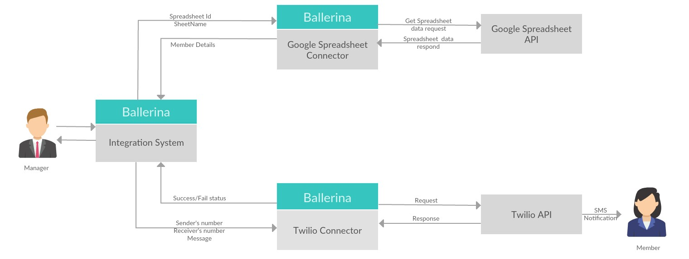
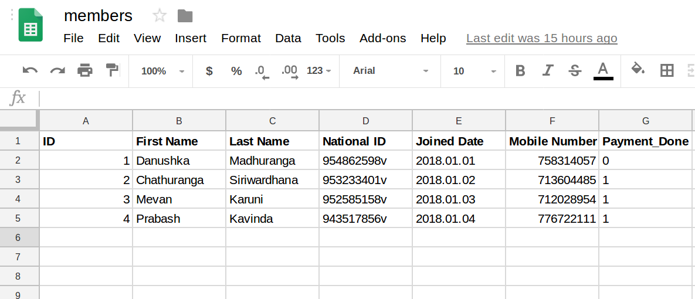

# Payment Notifier

## Why payment notifier

Payment notifier notify members of an organization on their due payments. For an example consider a swimming club which require its members to pay a monthly fee to the swimming club. Managers/Owners of the organization may hesitate to approach members and ask them directly on due payments. And also if the number of members are significantly high, it might be difficult to practically approach each member. Therefore, the proposed system will send an auto-generated SMS to the members who have not paid the monthly fee. In the swimming club, they may have a policy stating that the members need to pay monthly fee before 10th day of the month.  After the 10th day of the month, members who have not paid the monthly fee will get a notification SMS reminding of due payment. There could be multiple iterations such as notification after 15th day and again after 20th day according to the policies of the organization.

## Design

Google Spreadsheets service and Twilio SMS Service have been used for the project. Details of the members such as their mobile phone numbers will be saved in a google spreadsheet and it will be connected through wso2/gsheets4 package. SMS notifications will be sent through twilio sms service and it will be connected through wso2/twilio package.






## Implementation

### Package structure


```
paymentNotifier
  ├── ballerina.conf  
  └── paymentNotifier
      └── gsheetHandler.bal
      └── payment-notify.bal
      └── paymentDetailsReciever.bal
      └── smsHandler.bal
  └── tests    
```

## Running the application

Running the server.
```
    ballerina run paymentNotifier
```

Sending payment details to the server.

```
    curl -d "member_id" -X POST localhost:9092/memberPaid
```
